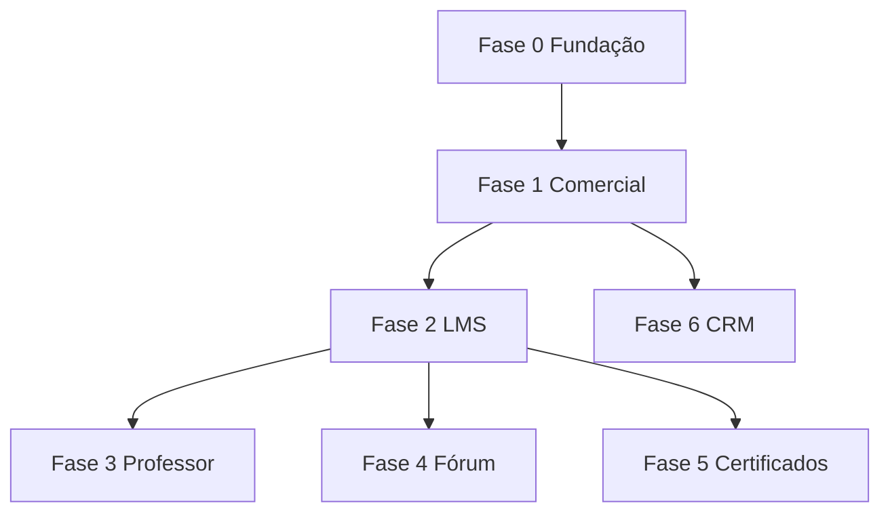

# Checklist de pendências — Escola Flávio Milhomem

> Roadmap para eliminar funcionalidades **Parcial** e **Pendente** da auditoria (maio/2026).  
> Ordem por **dependência de negócio**: comercial → acesso → conteúdo → comunidade → CRM.

**Legenda:** `[ ]` pendente · `[~]` em andamento · `[x]` concluído

---

## Encerramento do dia — 26/05/2026

> Registro rápido do que foi fechado hoje para retomada amanhã.

### Concluído hoje

- [x] Monograma substituído pelo asset final do design em `public/images/brand/logo-monogram-2026-05.png`
- [x] Header e footer unificados no mesmo monograma (ajuste de cache-bust do `next/image` + sizing)
- [x] `src/config/brand.ts` atualizado para versão de logo atual (`brandLogoVersion`) e proporção nativa
- [x] Fluxo comercial Fase 1 ativo em produção: checkout, resultado de pedido, webhook e matrícula manual
- [x] Deploy em produção realizado e validado em `https://escola-de-direito-milhomem-site.vercel.app`
- [x] Bootstrap de ambiente demo em produção concluído:
  - [x] Curso `prova-digital-no-processo-penal` publicado
  - [x] 10 aulas sincronizadas
  - [x] Usuário `aluno@escolaflaviomilhomem.com.br` criado/atualizado (nome: **Aluno Demonstração**)
  - [x] Usuário `professor@escolaflaviomilhomem.com.br` criado/atualizado (nome: **Professor Demonstração**)
  - [x] Pedido `PAID` para o aluno demo, liberando curso ativo na área do aluno

### Para retomar amanhã (contexto já pronto)

- [ ] Revisão final de UX textual das áreas `/aluno` e `/professor` (mensagens e labels)
- [ ] Validação ponta a ponta com os dois logins demo após hard refresh
- [ ] Decidir se endpoint de bootstrap demo permanece habilitado em produção ou ficará restrito a uso interno

---

## Visão das fases

| Fase  | Nome              | Objetivo                                    | Entrega principal                   |
| ----- | ----------------- | ------------------------------------------- | ----------------------------------- |
| **0** | Fundação produção | Site estável em Vercel com env e quick wins | Deploy + conta aluno + vitrine DB   |
| **1** | Comercial         | Vender e liberar acesso                     | Checkout Pagar.me + matrícula       |
| **2** | LMS unificado     | Aluno consome curso do banco                | Cursos/aulas runtime + progresso    |
| **3** | Painel professor  | Operar conteúdo sem scripts                 | CMS blog + CRUD aulas + upload prod |
| **4** | Comunidade        | Engajamento pós-compra                      | Fórum global + por aula             |
| **5** | Certificados      | Credencial verificável                      | Emissão + `/certificado/[hash]`     |
| **6** | CRM e métricas    | Growth e operação                           | UTM, campanhas, dashboard           |

---

## Fase 0 — Fundação produção

**Meta:** ambiente de produção confiável e correções que não dependem de pagamento.

### 0.1 Infra e ambiente

- [x] Projeto Vercel linkado ao repositório Git
- [x] `DATABASE_URL` (Neon) em Production
- [ ] `DATABASE_URL` em Preview (recomendado)
- [ ] `RESEND_API_KEY` + domínio de envio verificado
- [x] `AUTH_SECRET` em produção (Vercel)
- [ ] Upstash Redis (rate limit de leads) — opcional mas recomendado
- [x] `npm run build` verde no CI/Vercel
- [x] Migrations Prisma aplicadas em produção (`prisma migrate deploy` + baseline)

### 0.2 Conta do aluno (APIs já existem)

- [x] Conectar `UpdateProfileForm` em `/aluno/minha-conta`
- [x] Conectar `UpdatePasswordForm` em `/aluno/minha-conta`
- [x] Feedback de sucesso/erro (toast) nos forms

**Pronto quando:** aluno altera nome e senha sem suporte manual.

### 0.3 Vitrine marketing alinhada ao DB

- [x] `/cursos/[slug]` buscar `Product` no Prisma (remover TODO)
- [x] Fallback elegante se produto `DRAFT` ou inexistente
- [x] Catálogo `/cursos` listar produtos `PUBLISHED` (com fallback estático temporário se vazio)

**Pronto quando:** publicar curso no painel professor reflete na vitrine pública.

### 0.4 Higiene de código / docs

- [x] Atualizar comentário “placeholder” em `calculadora-de-pena/page.tsx`
- [x] Remover `mock-blog.ts` / `mock-professor.ts` (mortos)
- [x] Script `npm run seed:demo-users` (login aluno + professor na Vercel)

**Estimativa:** 1–3 dias · **Bloqueia:** nada · **Desbloqueia:** deploy real e testes de Fase 1

---

## Fase 1 — Comercial (crítica)

**Meta:** compra online → pedido pago → acesso ao curso.

### 1.1 Modelo e regras de negócio

- [x] Definir: produto `COHORT` = compra única; `COMUNIDADE` = assinatura
- [x] Tabela ou campo de “acesso até” (validade) se necessário para cohort — **MVP: sem expiração automática** (ver `docs/FASE-1-COMERCIAL.md`)
- [x] Documentar fluxos: cartão, PIX, boleto (quais no MVP)

### 1.2 Checkout (Pagar.me)

- [x] Página `/checkout/[productSlug]` ou modal na landing
- [x] Criar `Order` `PENDING` antes do redirect/API Pagar.me
- [x] Integração API Pagar.me (charge/order) com `amountCents` do `Product`
- [x] Captura de UTM na criação do pedido (`utmSource`, etc.)
- [x] Páginas de retorno: sucesso, pendente (PIX/boleto), recusado
- [x] Copy “checkout em implementação” removida das landings

**Arquivos-alvo:** nova rota checkout, `lib/payments/pagarme.ts`, `copy.ts`, `edicao-lancamento-landing.tsx`

### 1.3 Webhook

- [x] Validar HMAC (`PAGARME_WEBHOOK_SECRET`) em `api/webhooks/pagarme`
- [x] Idempotência por `eventId`
- [x] Mapear eventos → `Order.status` (`PAID`, `REFUSED`, `REFUNDED`, …)
- [x] Criar/atualizar `Subscription` quando produto for assinatura
- [x] Log/auditoria mínima de eventos (tabela ou log estruturado)

**Pronto quando:** pagamento teste em sandbox atualiza `Order` no Neon.

### 1.4 Matrícula e autorização

- [x] `lib/enrollment.ts`: `userHasAccess(userId, productSlug)`
- [x] Substituir `enrolledCourses` fixo por consulta a `Order`/`Subscription` (dashboard, certificados, `/aluno/cursos`)
- [x] Guard em `/aluno/cursos/*` e `/aluno/aulas/*` (redirect ou upsell se sem acesso)
- [x] `/aluno/minha-conta`: listar pedidos reais do usuário
- [x] Admin: conceder acesso manual (opcional, útil para turma fundadora)

**Pronto quando:** usuário sem `Order PAID` não abre o player; com `PAID`, abre.

**Estimativa:** 1–2 semanas · **Bloqueia:** monetização · **Desbloqueia:** Fases 2, 4, 5 com regra justa

---

## Fase 2 — LMS unificado

**Meta:** conteúdo do aluno vem do Postgres (alinhado ao import), não só do manifest estático.

### 2.1 Sincronização conteúdo

- [ ] Garantir `npm run seed:prova-digital` / `import:provas-digitais` documentado no README
- [ ] `Product` + `Lesson` no DB espelham manifest (slug, título, ordem, `durationSec`)
- [ ] Job ou script idempotente: manifest → DB (para reimportações)

### 2.2 Runtime aluno

- [ ] `getEnrolledCourses(userId)` → join Order + Product + Lessons
- [ ] Páginas `/aluno/cursos/[slug]` leem módulos/aulas do DB (ou cache)
- [ ] Player: `videoSrc` ou `videoId` (Stream) resolvido a partir de `Lesson`
- [ ] Slides/materiais: campo em `Lesson` ou JSON metadata se necessário

### 2.3 Progresso

- [ ] Progresso inicial não hardcoded no manifest
- [ ] `PATCH /api/aluno/lessons/progress` valida que usuário tem acesso ao `productId` da aula
- [ ] Dashboard: % conclusão calculado do DB
- [ ] “Continuar assistindo” baseado em `UserLessonProgress`

**Pronto quando:** alterar título de aula no DB reflete na área do aluno (após publicar).

**Estimativa:** 1 semana · **Depende de:** Fase 1 (gate) · **Paralelo possível:** parte do seed sem gate em dev

---

## Fase 3 — Painel professor (conteúdo)

**Meta:** professor opera curso e blog sem rodar scripts locais.

### 3.1 Upload em produção

- [ ] Vercel Blob (ou S3) para capa/banner/aula
- [ ] `POST /api/professor/upload` habilitado em produção com auth
- [ ] Remover bloqueio 403 em `NODE_ENV=production`
- [ ] Validar MIME/tamanho e path seguro

### 3.2 CRUD de aulas

- [ ] API `professor/products/[slug]/lessons` (GET, POST, PATCH, DELETE)
- [ ] UI em `/professor/cursos/[slug]/editar` — aba Módulos/Aulas
- [ ] Reordenar aulas (`position`)
- [ ] Publicar/despublicar aula (`publishedAt`)

### 3.3 Blog CMS

- [ ] `POST/PATCH /api/professor/blog` persistindo `BlogPost`
- [ ] Remover `alert` do `blog-editor.tsx`
- [ ] Status DRAFT / PUBLISHED / SCHEDULED
- [ ] Preview antes de publicar (opcional)

### 3.4 Painel operacional (mínimo)

- [ ] `/professor/alunos`: listar usuários com `Order PAID` por produto
- [ ] `/professor/dashboard`: KPIs reais (matrículas, receita período — se Pagar.me expuser)
- [ ] `/professor/aulas`: opcional unificar com editor do curso ou deprecar

**Estimativa:** 1–2 semanas · **Depende de:** Fase 2 (modelo Lesson estável)

---

## Fase 4 — Comunidade (fórum)

**Meta:** discussões por aula e fórum global.

### 4.1 API

- [ ] `GET/POST /api/aluno/lessons/[lessonId]/comments`
- [ ] Threads (`parentId`), moderação `PENDING` → `APPROVED`
- [ ] `GET /api/aluno/forum` — feed agregado por curso matriculado
- [ ] Professor: `PATCH /api/professor/comments/[id]` (aprovar/rejeitar)

### 4.2 UI aluno

- [ ] Substituir empty state em `/aluno/forum` por `forum-feed` com dados reais
- [ ] Aba “Comunidade” na `/aluno/aulas/[slug]` funcional
- [ ] Reutilizar/adaptar `comment-tree.tsx`

### 4.3 UI professor

- [ ] `/professor/forum` — fila de moderação

**Pronto quando:** aluno com matrícula posta na aula 1 e professor aprova.

**Estimativa:** 1 semana · **Depende de:** Fase 1 (matrícula) + Fase 2 (`Lesson.id` estável)

---

## Fase 5 — Certificados

**Meta:** credencial ao concluir curso + validação pública.

### 5.1 Modelo

- [ ] Novo model `Certificate` (ou campos em `User`+`Product`): `hash`, `issuedAt`, `userId`, `productId`
- [ ] Regra: 100% aulas `completedAt` OU critério definido com cliente

### 5.2 Emissão

- [ ] Job ou trigger ao completar última aula
- [ ] PDF ou página imprimível (MVP: HTML estilizado)
- [ ] `/aluno/certificados` lista certificados do usuário

### 5.3 Validação pública

- [ ] `/certificado/[hash]` consulta DB e exibe nome, curso, data
- [ ] Estado inválido/expirado tratado

**Estimativa:** 3–5 dias · **Depende de:** Fase 2 (progresso confiável)

---

## Fase 6 — CRM, métricas e polish

**Meta:** growth e operação de turma.

### 6.1 Tracking

- [ ] Persistir `UTMEvent` no primeiro hit (middleware ou client)
- [ ] Associar UTM ao `Order` no checkout
- [ ] PostHog eventos: `purchase`, `lesson_complete`, `lead_confirm`

### 6.2 E-mail marketing

- [ ] CRUD mínimo `EmailCampaign` (admin)
- [ ] Envio em lote via Resend (segmento: leads confirmados)

### 6.3 Professor — turma

- [ ] `/professor/anuncios` — avisos por produto (model `Announcement` ou campo JSON)
- [ ] `/professor/metricas` — gráficos reais (matrículas, conclusão, fórum)

### 6.4 Qualidade

- [ ] Sentry em `error.tsx`
- [ ] Testes e2e críticos: login, lead, checkout sandbox, player
- [ ] `llms.txt` / SEO revisados pós-lançamento

**Estimativa:** contínua · **Depende de:** Fases 1–2 para dados reais

---

## Ordem recomendada para começar **agora**

1. **Fase 0.1** — Vercel + env + migrate (se ainda não feito)
2. **Fase 0.2** — Minha conta (rápido, APIs prontas)
3. **Fase 0.3** — `/cursos/[slug]` no Prisma
4. **Fase 1** — Checkout + webhook + matrícula (**prioridade máxima de negócio**)

Depois: Fase 2 em paralelo com início da 3 (upload produção).

---

## Variáveis de ambiente (acumulado)

| Variável                                    | Fase |
| ------------------------------------------- | ---- |
| `DATABASE_URL`                              | 0    |
| `JWT_SECRET`, `RESEND_API_KEY`              | 0    |
| `PAGARME_API_KEY`, `PAGARME_WEBHOOK_SECRET` | 1    |
| `BLOB_READ_WRITE_TOKEN` (Vercel Blob)       | 3    |
| `UPSTASH_*`                                 | 0/6  |
| `NEXT_PUBLIC_POSTHOG_*`                     | 6    |

---

## Controle de progresso

| Fase | Itens | Concluídos | %    |
| ---- | ----- | ---------- | ---- |
| 0    | 17    | 14         | 82%  |
| 1    | 19    | 19         | 100% |
| 2    | 11    | 0          | 0%   |
| 3    | 15    | 0          | 0%   |
| 4    | 8     | 0          | 0%   |
| 5    | 7     | 0          | 0%   |
| 6    | 10    | 0          | 0%   |

_Atualizar a tabela ao marcar `[x]` nos itens acima._

---

_Última atualização: maio/2026 — gerado a partir da auditoria de funcionalidades._
